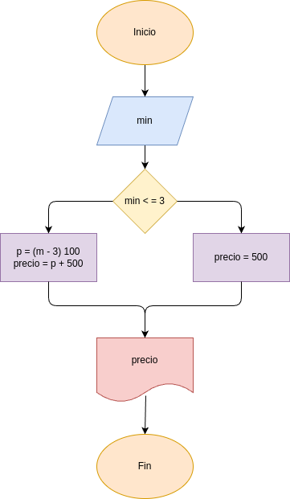

# EJERCICIO_2: duracion_llamada
- Programa en Python para determinar el costo de una llamada

## Análisis

### Variables de entrada
- min: duracion de la llamada

### Procesamiento
- p : (m + 300) * 100

$min < = 3 = 500$

$min > 3$

### Variable de salida
- precio

## Diseño

## Construcción

- codigo implementado en el archivo duracion_llamada.py