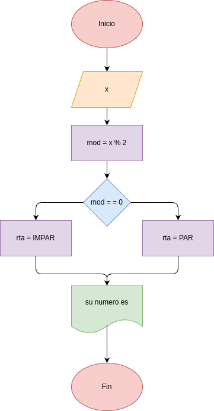

# EJERCICIO_3: numero_par
- Programa en Python para determinar si un número entero es par o impar

## Análisis

### Variables de entrada
- n : número entero

### Procesamiento
- r : n % 2

$r = = 0$

### Variables de salida
- su numero es

## Diseño

## Construcción

- codigo implementado en el archivo numero_par.py