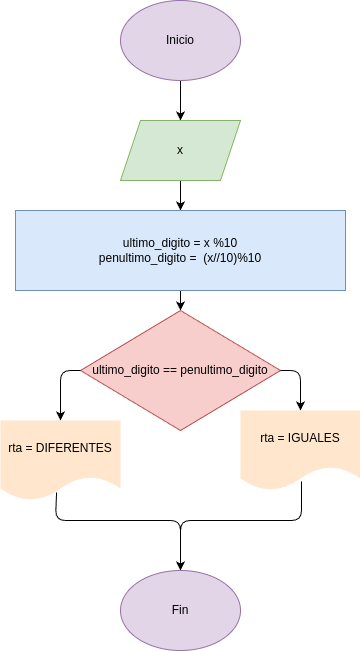

# EJERECICIO_4: ultimo_digito
- Programa en Python para determinar si los dos ultimos digitos de un número entero son iguales o no

## Análisis

### Variables de entrada
- x: número entero

### Procesamiento
- ultimo_digito = x %10
- penultimo_digito = (x/10)%10

$ultimo_digito==penultimo_digito$

### Variables de salida
- IGUALES
- DIFERENTES

## Diseño

## Construcción

- codigo implementado en el archivo ultimo_digito.py