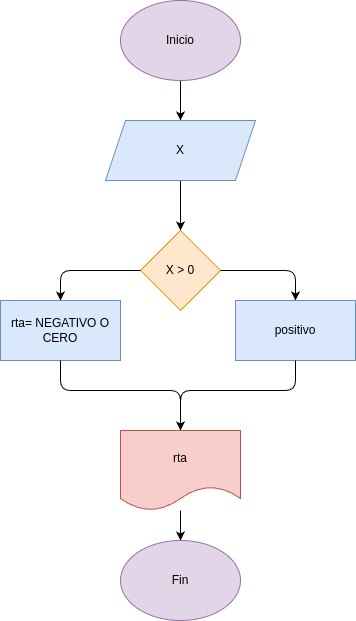
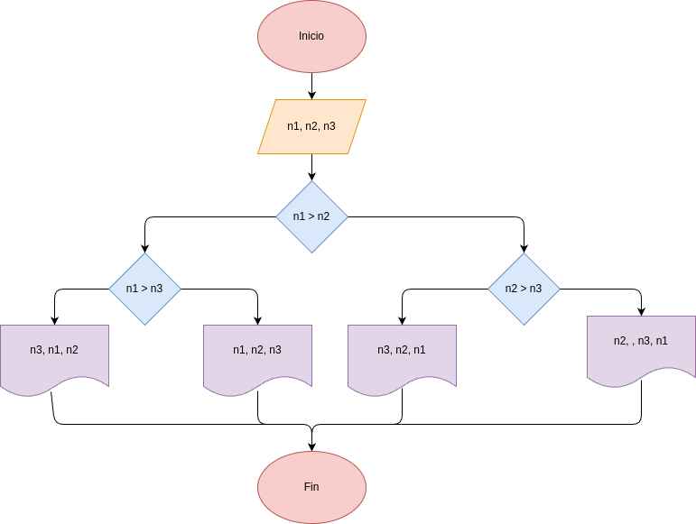
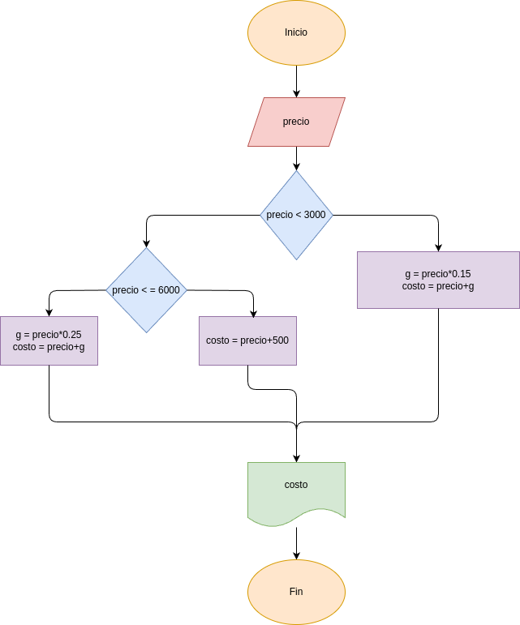

# taller_condicionales
Proyecto en Python para resolver seis ejercicios en diferentes carpetas

## Diseños de los programas

- EJERCICIO_1: Ejercicio para determinar si un número entero es positivo o negativo

   

- EJERCICIO_2: Ejercicio para determinar el costo de una llamada segun su duración

- EJERCICIO_3: Ejercicio para determinar si un número entero es par o impar

- EJERCICIO_4: Ejercicio para determinar si los dos ultimos digitos de un número entero son igualos o son diferentes

- EJERCICIO_5: Ejercicio para determinar entre tres números enteros es mayor que los otros dos

- EJERCICIO_6: Ejercicio para determinar el precio de venta de un producto segun su precio de compra

